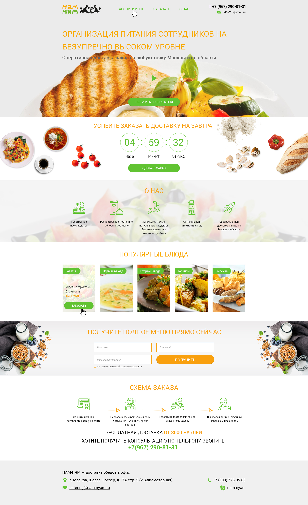

# Проект «Nyam-nyam»

* Вёрстка: [Виталий Дубинка (Pixel-Man)](https://github.com/Pixel-Man).
* С реализованным проектом можно ознакомится по [ссылке](https://pixel-man.github.io/Nyam-nyam/).

## Описание

* Используемые технологии: _HTML, CSS, БЭМ, JS, Адаптивный дизайн_.
* Фреймворки: _нет_.
* Препроцессоры: _SCSS_.
* Автоматизация: _Gulp_.

